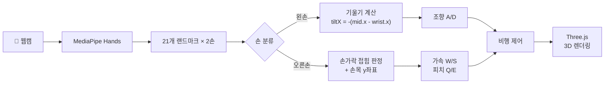
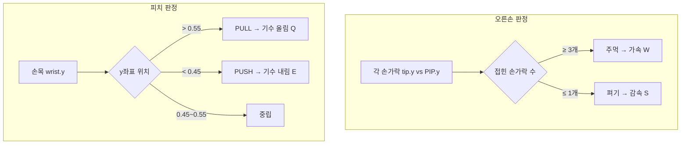
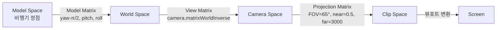
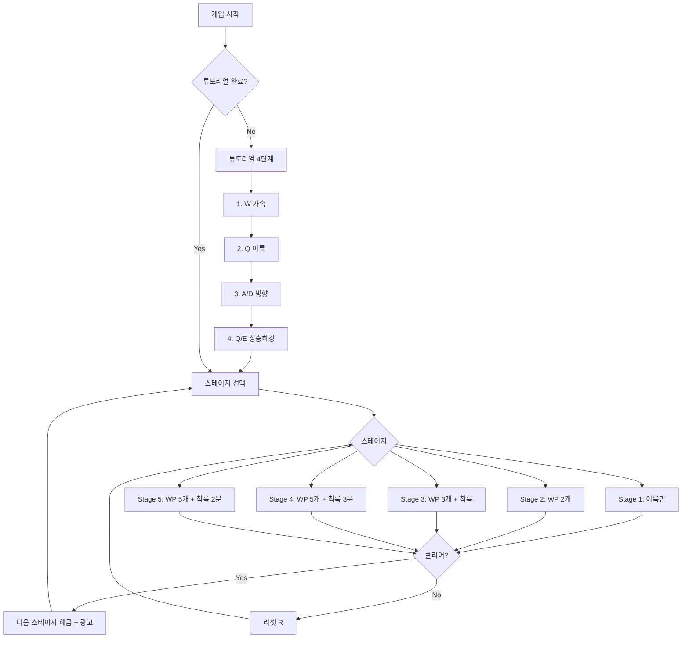
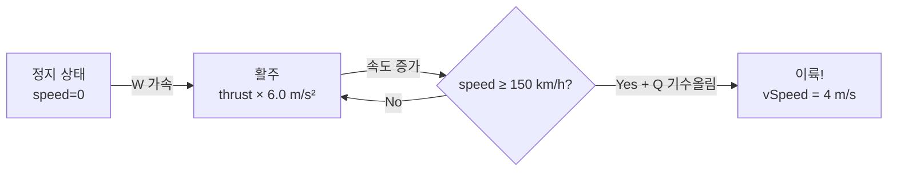
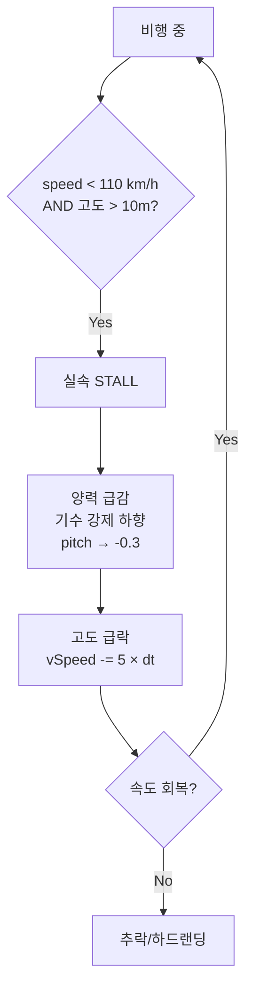
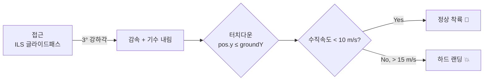
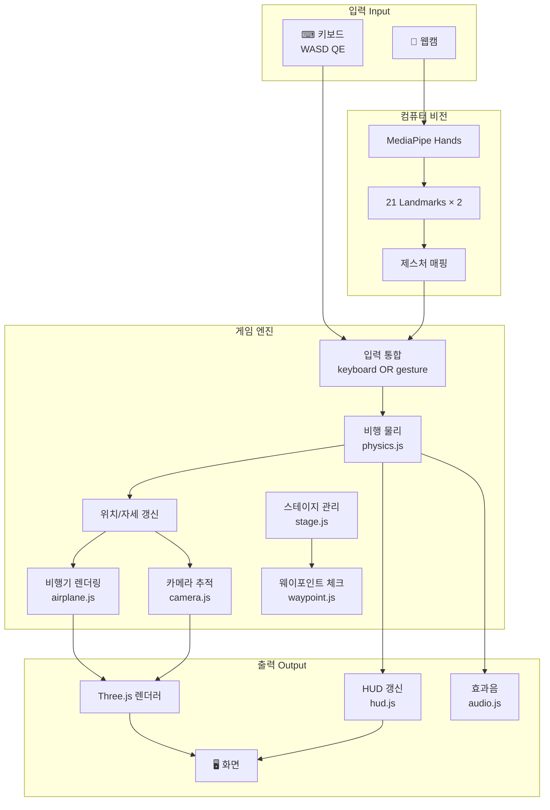

# HandPilot ✈

**손 제스처로 조종하는 3D 웹 비행 시뮬레이터**

## 프로젝트 소개

HandPilot은 MediaPipe Hand Tracking과 Three.js를 활용한 브라우저 기반 3D 비행 시뮬레이터입니다.
키보드 없이 웹캠에 비치는 양손 제스처만으로 비행기를 조종할 수 있습니다.

### 핵심 기술

- **MediaPipe Hands** — 실시간 양손 랜드마크 인식 (21개 관절 × 2)
- **Three.js** — 절차적 3D 월드 생성 및 비행 물리 시뮬레이션
- **Web Audio API** — 비행 효과음 생성
- **PWA** — 오프라인 지원, 앱 설치 가능

### 조작 방식

| 입력 | 키보드 | 손 제스처 |
|------|--------|-----------|
| 가속 | W | 오른손 주먹 쥐기 |
| 감속 | S | 오른손 펴기 |
| 좌/우 선회 | A / D | 왼손 기울이기 |
| 기수 올림 (이륙) | Q | 오른손 아래로 당기기 |
| 기수 내림 (하강) | E | 오른손 위로 밀기 |

### 컴퓨터 비전 파이프라인



#### 손 랜드마크 → 제스처 변환

**1. 왼손: 조향 (Steering)**
- 손목(landmark[0])과 중지 기저(landmark[9])의 x좌표 차이로 기울기(tilt) 계산
- `tiltX = -(middleBase.x - wrist.x)` (웹캠 좌우 미러링 보정을 위해 부호 반전)
- 임계값(threshold=0.03) 기반으로 A/D 입력 매핑

**2. 오른손: 동력 + 피치**
- 손가락 접힘 판정: 각 손가락 tip(8,12,16,20)과 PIP(6,10,14,18)의 y좌표 비교
- 3개 이상 접힘 → 주먹(가속), 1개 이하 접힘 → 펴기(감속)
- 손목 y좌표로 기수 상하: `y > 0.55` → 기수 올림(PULL), `y < 0.45` → 기수 내림(PUSH)

#### 손가락 접힘 판정 로직



#### 3D 회전 및 카메라 수학

**비행기 회전 (Euler Angles, YZX order)**
- 모델 노즈가 +X축 → `rotation.y = yaw - π/2`로 이동 방향 정렬
- `rotation.z = pitch` (기수 상하)
- `rotation.x = -roll` (좌우 뱅크)

**이동 벡터**
```
pos.x += sin(yaw) × speed × dt
pos.z += cos(yaw) × speed × dt
```

**카메라 추적 (3인칭)**
- 비행기 뒤 방향 벡터: `behind = (-sin(yaw), 0, -cos(yaw)) × camDist`
- pitch 오프셋 적용 후 `lerp`으로 부드럽게 추적

#### MVP 변환 파이프라인



#### 카메라 변환 행렬

Three.js의 `PerspectiveCamera`는 내부적으로 두 가지 행렬을 관리합니다:

**1. 프로젝션 행렬 (Projection Matrix)** — 3D → 2D 클립 공간 변환

```
| 2n/(r-l)    0       (r+l)/(r-l)    0        |
|    0     2n/(t-b)   (t+b)/(t-b)    0        |
|    0        0      -(f+n)/(f-n)  -2fn/(f-n) |
|    0        0          -1          0        |
```
- FOV=65°, near=0.5, far=3000 설정에서 자동 계산
- `camera.updateProjectionMatrix()`로 화면 비율 변경 시 재계산

**2. 뷰 행렬 (View Matrix)** — 월드 좌표 → 카메라 좌표 변환

```
V = (카메라 월드 행렬)⁻¹ = camera.matrixWorldInverse
```
- `camera.lookAt(target)`이 호출되면 카메라의 forward/up/right 벡터로 뷰 행렬 구성
- 최종 MVP 변환: `gl_Position = Projection × View × Model × vertex`

**3. 카메라 위치 계산 (매 프레임)**
```javascript
// 비행기 뒤쪽 오프셋 (구면좌표계)
offset.x = -sin(yaw) × cos(pitch) × distance
offset.y =  sin(pitch) × distance
offset.z = -cos(yaw) × cos(pitch) × distance

// 부드러운 추적 (선형 보간)
camera.position = lerp(현재, 목표 + offset, dt × 10)
```

### 게임 흐름



### 비행 물리 모델

```mermaid
flowchart TD
    subgraph 힘 Forces
        T["Thrust<br/>thrust × 6.0 m/s²"]
        L["Lift<br/>speed² × 0.0035 × stallFactor"]
        D["Drag<br/>induced + parasitic"]
        G["Gravity<br/>9.81 m/s²"]
    end
    subgraph 상태 전이
        GR[GROUND] -->|speed ≥ 150 km/h| AIR[AIR]
        AIR -->|pos.y ≤ groundY| GR
        AIR -->|speed < 110 km/h| ST[STALL]
        ST -->|speed ≥ 110 km/h| AIR
    end
    T & L & D & G --> PH["물리 엔진<br/>speed, vSpeed, position 갱신"]
    PH --> 상태 전이
```

### 이착륙 물리 원리

#### 이륙 (Takeoff)



실제 항공기와 동일하게, 양력은 속도의 제곱에 비례합니다:

```
Lift = speed² × 0.0035 × stallFactor
```

- 저속에서는 양력 < 중력 → 지상 활주만 가능
- **이륙 속도(Vr = 150 km/h)** 도달 시 양력 > 중력 → 이륙 가능
- `stallFactor`는 실속 속도(110 km/h) 근처에서 0→1로 변화하여 급격한 양력 손실을 시뮬레이션

#### 비행 중 힘의 균형

```
가속도 = Thrust - InducedDrag - ParasiticDrag

InducedDrag  = (g / speed) × 0.8       ← 저속에서 커짐 (날개 와류)
ParasiticDrag = speed² × 0.0012         ← 고속에서 커짐 (공기 마찰)

수직가속 = (Lift + PitchLift) - Gravity
PitchLift = pitch × speed × 0.6        ← 기수 올리면 상승, 내리면 하강
```

- 추력과 항력이 균형 → 등속 순항
- 기수 각도(pitch)로 상승률 제어 — 실제 조종과 동일한 원리

#### 실속 (Stall)



실제 항공기의 실속 현상을 시뮬레이션:
- 받음각(angle of attack)이 임계치를 넘으면 날개 상면의 기류가 박리
- 본 시뮬레이터에서는 속도 기반으로 단순화: **110 km/h 미만**이면 양력 계수 급감

#### 착륙 (Landing)



- **ILS(Instrument Landing System)** 글라이드패스: 착륙 활주로까지 3° 강하 경로를 시각화
- 수직속도(vSpeed) 기준으로 착륙 품질 판정
  - < 10 m/s → 정상 착륙
  - 10~15 m/s → 바운스 (다시 떠오름)
  - \> 15 m/s → 하드 랜딩

## 시스템 아키텍처



## 프로젝트 구조

```
handpilot/
├── index.html            # HTML 구조
├── css/style.css         # 스타일 (반응형 포함)
├── js/
│   ├── main.js           # 진입점, 렌더러, 게임 루프
│   ├── airplane.js       # 비행기 3D 모델 (절차적 생성)
│   ├── world.js          # 지형, 활주로, 나무, 산, 호수, 도시
│   ├── physics.js        # 비행 물리 (양력, 항력, 스톨)
│   ├── camera.js         # 3인칭 카메라 추적
│   ├── hud.js            # HUD, 배너, AHI, 미니맵
│   ├── audio.js          # Web Audio API 효과음
│   ├── hands.js          # MediaPipe 손 인식 + 제스처 매핑
│   ├── stage.js          # 튜토리얼 + 스테이지 진행
│   └── waypoint.js       # 웨이포인트, ILS 착륙 유도
├── manifest.json         # PWA 매니페스트
├── sw.js                 # Service Worker
└── icon-*.png            # PWA 아이콘
```

## 실행 방법

HTTPS 환경에서 `index.html`을 열면 바로 실행됩니다. (웹캠 접근에 HTTPS 필요)

```bash
# 로컬 개발 서버 예시
npx serve .
```

## 배포

- **URL**: https://handpilot.co.kr
- Docker (nginx:alpine) + Let's Encrypt SSL

## 개발 계획

### Phase 1 — 핵심 기능 (완료)
- [x] Three.js 기반 3D 월드 구성 (지형, 활주로, 나무, 산, 호수, 도시)
- [x] 절차적 비행기 모델 생성
- [x] 비행 물리 엔진 (양력, 항력, 스톨, 착륙 판정)
- [x] 키보드 조작 (WASD + QE)
- [x] 3인칭 카메라 추적

### Phase 2 — 컴퓨터 비전 (완료)
- [x] MediaPipe Hands 통합
- [x] 양손 제스처 → 비행 제어 매핑
- [x] 웹캠 미러링 보정
- [x] 손 랜드마크 오버레이 시각화
- [x] 가상 조이스틱 HUD

### Phase 3 — 게임성 (완료)
- [x] 온보딩 튜토리얼 (레일 방식 4단계)
- [x] 스테이지 시스템 (5단계 난이도)
- [x] 웨이포인트 + ILS 착륙 유도
- [x] Web Audio API 효과음
- [x] 진행상황 localStorage 저장

### Phase 4 — 배포 (완료)
- [x] PWA (manifest.json + Service Worker)
- [x] Docker 컨테이너화
- [x] HTTPS (Let's Encrypt SSL)
- [x] 도메인 연결 (handpilot.co.kr)
- [x] AdSense 광고 연동

### Phase 5 — 개선 예정
- [ ] 기체 종류 추가 (전투기, 경비행기, 헬리콥터 등 기체별 물리 특성 차별화)
- [ ] 맵 다양화 (사막, 야간, 해안 도시, 설산 등 테마별 스테이지)
- [ ] 날씨/난기류 시스템
- [ ] 모바일 터치 조작 최적화
- [ ] 리더보드 (클리어 타임 기록)

## 기술 스택

| 분류 | 기술 |
|------|------|
| 3D 렌더링 | Three.js |
| 손 인식 | MediaPipe Hands |
| 오디오 | Web Audio API |
| 배포 | Docker, Nginx, Let's Encrypt |
| 프론트엔드 | Vanilla JS (ES Modules) |
