# HandPilot ✈

**Web-based 3D Flight Simulator for Hand Gesture Control and Rollout Data Collection**

> 브라우저에서 실행되는 3D 비행 시뮬레이터.
> MediaPipe로 손 제스처를 실시간 인식하여 비행기를 조종하고,
> Ghost Route Planner로 미래 경로를 시각화하며,
> Auto Rollout으로 RL 학습용 trajectory 데이터를 자동 수집합니다.


---

## 목차

- [프로젝트 소개](#프로젝트-소개)
- [컴퓨터 비전 파이프라인](#컴퓨터-비전-파이프라인)
- [Ghost Route Planner](#ghost-route-planner)
- [Auto Rollout & 데이터 수집](#auto-rollout--데이터-수집)
- [시스템 아키텍처](#시스템-아키텍처)
- [프로젝트 구조](#프로젝트-구조)
- [실행 방법](#실행-방법)
- [기술 스택](#기술-스택)
- [관련 연구](#관련-연구)

---

## 프로젝트 소개

### 배경 및 동기

Ha & Schmidhuber의 **World Models** (2018)와 이를 발전시킨 **DreamerV3** (2023) 등의 연구는 에이전트가 환경의 내부 모델(world model)을 학습하여 상상 속에서 계획을 세울 수 있음을 보였다. 최근의 **LeWM** (2026) 연구는 이러한 world model 학습을 위해 **실제 환경과 유사한 시뮬레이터에서 수집된 고품질 trajectory 데이터**가 핵심임을 강조한다.

그러나 flight domain에서 직접 사용 가능한 브라우저 기반 시뮬레이터 + 데이터 수집 파이프라인은 존재하지 않는다. HandPilot은 이 필요성에서 출발했다: **손 제스처 인터페이스**로 조종 가능한 3D 비행 시뮬레이터를 직접 구축하고, 여기서 RL/world model 학습에 필요한 trajectory 데이터를 자동 수집할 수 있는 환경을 만드는 것이 목표다.

### HandPilot이 제공하는 것

| 기능 | 설명 |
|------|------|
| **손 제스처 비행 제어** | MediaPipe Hands로 양손 21개 랜드마크를 실시간 인식, 키보드 없이 비행기 조종 |
| **경로 시각화** | Ghost Route Planner가 현재 상태에서 5초 후 6가지 예측 경로를 3D로 표시 |
| **Rollout 데이터 수집** | Auto Rollout이 이륙→웨이포인트 통과 trajectory를 자동 반복 수집, RL/world model 학습 데이터로 export |

### 시연 영상

<table><tr>
<td align="center"><b>Auto Rollout</b></td>
<td align="center"><b>손 제스처 직접 조종</b></td>
</tr><tr>
<td><a href="https://www.youtube.com/shorts/sHeplgumy7E"></a></td>
<td><a href="https://youtube.com/shorts/1YLzLbbUa_g"></a></td>
</tr></table>

---

## 컴퓨터 비전 파이프라인

### 전체 흐름

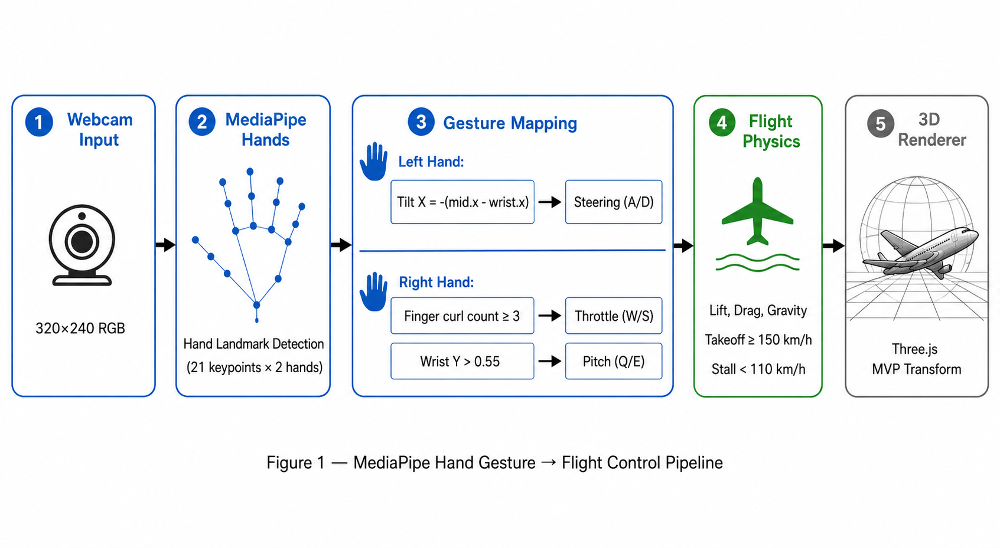

### 왼손: 조향

손목(landmark 0)과 중지 기저(landmark 9)의 x좌표 차이로 기울기 계산.

$$
\text{tiltX} = -\left(x_{\text{middleBase}} - x_{\text{wrist}}\right)
\quad \text{(미러링 보정을 위해 부호 반전)}
$$

- $\text{tiltX} < -0.03$ → 좌회전 (A)
- $\text{tiltX} > +0.03$ → 우회전 (D)

### 오른손: 동력 + 피치

**손가락 접힘 판정** — tip(8,12,16,20) y좌표 vs PIP(6,10,14,18) y좌표 비교:

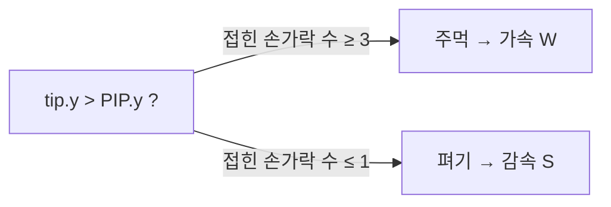

**피치 판정** — 손목 y좌표:

| 손목 위치 | 입력 | 효과 |
|-----------|------|------|
| `wrist.y > 0.55` | Q | 기수 올림 (이륙/상승) |
| `wrist.y < 0.45` | E | 기수 내림 (하강) |
| 0.45 ~ 0.55 | — | 중립 |

### 비행 물리 모델

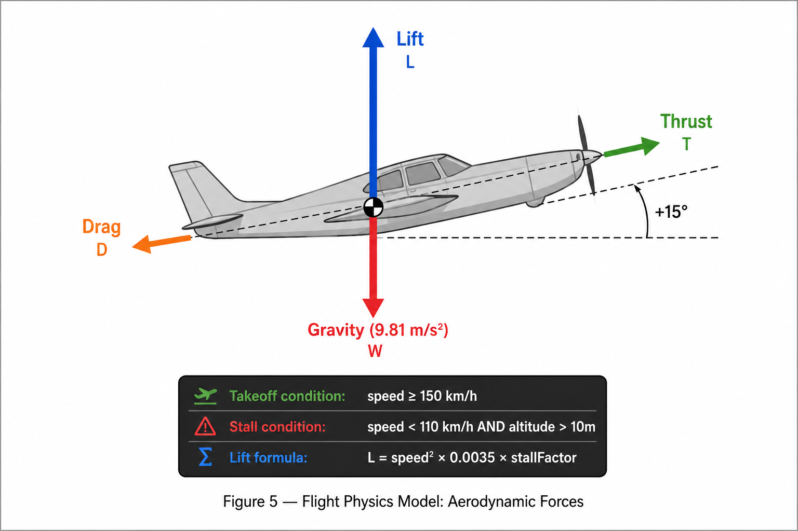

$$
\text{stallFactor} = \text{clip}\!\left(\frac{v_{\text{kmh}} - 55}{55},\ 0,\ 1\right)
$$

$$
L = \underbrace{v^2 \times 0.0035}_{\text{속도 양력}} \times \text{stallFactor}
  + \underbrace{\theta \times v \times 0.6}_{\text{피치 양력}} \times \text{stallFactor}
$$

$$
D = \frac{9.81}{v} \times 0.8 + v^2 \times 0.0012 \qquad \text{(유도항력 + 형상항력)}
$$

$$
\dot{v}_y = (L - 9.81)\,\Delta t - 5\,\Delta t \cdot \mathbb{1}_{\text{stall}}
$$

$$
\text{이륙}: v \geq 150 \text{ km/h}, \quad
\text{실속}: v < 110 \text{ km/h} \land h > 10 \text{ m}
$$

### 3D 렌더링 수학

#### MVP 변환 파이프라인

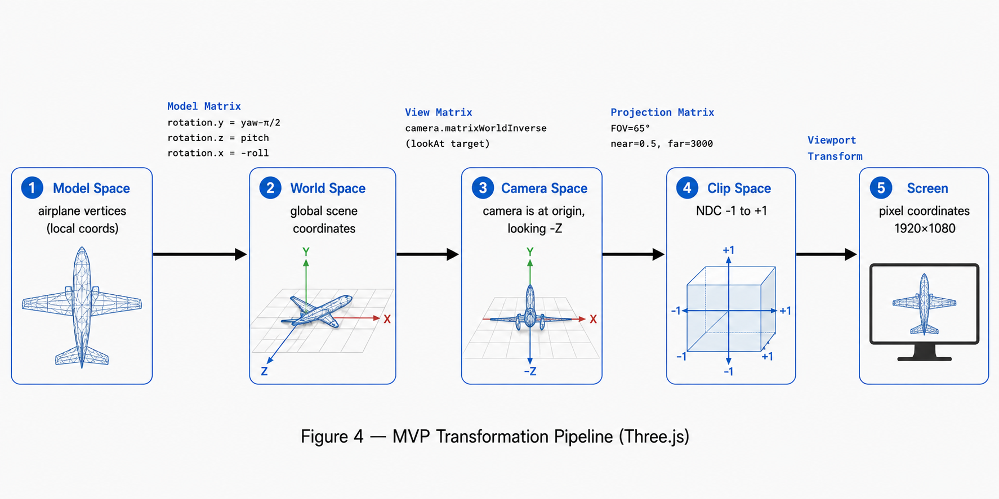

#### 프로젝션 행렬 (Projection Matrix)

$$
P = \begin{pmatrix}
\frac{2n}{r-l} & 0 & \frac{r+l}{r-l} & 0 \\
0 & \frac{2n}{t-b} & \frac{t+b}{t-b} & 0 \\
0 & 0 & -\frac{f+n}{f-n} & -\frac{2fn}{f-n} \\
0 & 0 & -1 & 0
\end{pmatrix}
$$

FOV=65°, near=0.5, far=3000 기준으로 자동 계산. 창 크기 변경 시 `camera.updateProjectionMatrix()` 재계산.

#### 뷰 행렬 (View Matrix)

$$
V = M_{\text{camera}}^{-1}
$$

(`camera.matrixWorldInverse`)

`camera.lookAt(target)` 호출 시 forward/up/right 벡터로 뷰 행렬 구성. 최종 변환:

$$
P \times V \times M \times \mathbf{v}
$$

#### 비행기 회전 (Euler Angles, YZX order)

$$
R_y = \text{yaw} - \frac{\pi}{2}, \quad R_z = \text{pitch}, \quad R_x = -\text{roll}
$$

모델 노즈가 +X축 방향이므로 $-\tfrac{\pi}{2}$ 보정 적용.

#### 카메라 위치 계산 (매 프레임, 구면좌표계)

$$
\mathbf{offset} = d \begin{pmatrix} -\sin\psi\cos\theta \\ \sin\theta \\ -\cos\psi\cos\theta \end{pmatrix}
$$

$$
\mathbf{p}_{\text{cam}} = \text{lerp}\!\left(\mathbf{p}_{\text{cam}},\; \mathbf{p}_{\text{plane}} + \mathbf{offset},\; \Delta t \times 10\right)
\quad \text{(부드러운 추적)}
$$

---

## Ghost Route Planner

현재 비행 상태에서 **5초 후 6가지 후보 경로**를 physics 롤아웃으로 시뮬레이션하여 3D로 표시.

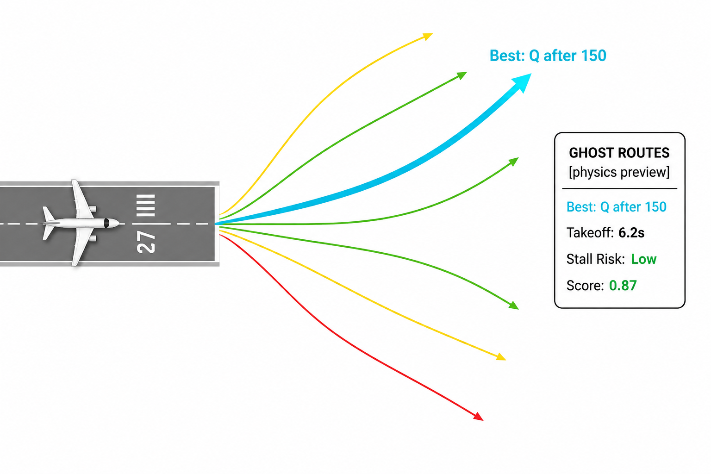

### 후보 경로

| 경로 | 전략 |
|------|------|
| Route A | 가속만, 기수 올림 없음 |
| Route B | 150 km/h 이후 기수 올림 |
| Route C | 120 km/h 이후 기수 올림 |
| Route D | 즉시 기수 올림 |
| Route E | 150 km/h 이후 펄스 기수 올림 |
| Route F | 활주로 편차 보정 + 기수 올림 |

### 경로 점수 및 색상

$$
\text{score} = 4.0 \cdot \mathbb{1}_{\text{takeoff}}
             + 0.015 \cdot \Delta h
             + 0.004 \cdot v_{\text{kmh}}
             - 5.0 \cdot \mathbb{1}_{\text{stall}}
             - 0.01 \cdot |x_{\text{lateral}}|
             - 1.5 \cdot \mathbb{1}_{|\theta|>0.5}
             - 1.0 \cdot \mathbb{1}_{|\phi|>0.5}
$$

| 색상 | 의미 |
|------|------|
| 🟢 초록 | 안정적 이륙 + 양의 상승 |
| 🟡 노랑 | 약한 상승 또는 불안정 |
| 🔴 빨강 | 실속 / 추락 위험 |
| 🔵 청록 | Best (최고 점수) 경로 |

> `[physics preview]` — 현재 경로는 물리 시뮬레이션 기반이며 학습된 모델이 아님

---

## Auto Rollout & 데이터 수집

**목표**: 이륙 → 첫 번째 웨이포인트 통과까지의 trajectory를 자동 반복 수집

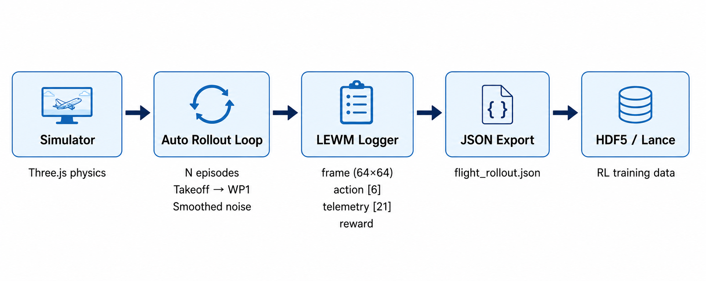

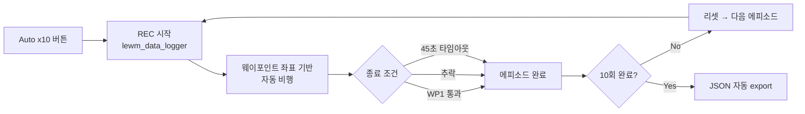

### 수집 데이터 형식

매 스텝(`captureEvery=10` 프레임마다)기록:

```json
{
  "episode": 1,
  "step": 30,
  "frame": "data:image/jpeg;base64,...",
  "action": [1, 0, 0, 1, 0, 0],
  "telemetry": [0.0, 1.8, 124.0, 38.2, 0.85, ...],
  "reward": 0.14,
  "done": false
}
```

#### action — 6차원 이진 벡터

| 인덱스 | 키 | 의미 |
|--------|-----|------|
| 0 | W | 추력 증가 |
| 1 | S | 감속 / 브레이크 |
| 2 | A | 좌회전 |
| 3 | D | 우회전 |
| 4 | Q | 기수 올림 (피치 업) |
| 5 | E | 기수 내림 (피치 다운) |

#### telemetry — 21차원 벡터

| 인덱스 | 이름 | 설명 |
|--------|------|------|
| 0 | x | 위치 x |
| 1 | y | 고도 |
| 2 | z | 위치 z |
| 3 | speed | 대기속도 (m/s) |
| 4 | thrust | 추력 (0~1) |
| 5 | yaw | 방위각 (rad) |
| 6 | pitch | 기수 상하각 (rad) |
| 7 | roll | 뱅크각 (rad) |
| 8 | vSpeed | 수직속도 (m/s) |
| 9 | phase_ground | 지상 여부 (0/1) |
| 10 | phase_air | 공중 여부 (0/1) |
| 11 | stall | 실속 여부 (0/1) |
| 12 | gearDown | 착륙장치 (0/1) |
| 13 | next_wp_dx | 다음 WP까지 x 거리 |
| 14 | next_wp_dy | 다음 WP까지 y 거리 |
| 15 | next_wp_dz | 다음 WP까지 z 거리 |
| 16 | runway_lateral_error | 활주로 중심선 편차 |
| 17 | runway_distance | 활주로까지 거리 |
| 18 | takeoff_event | 이륙 발생 (0/1) |
| 19 | hard_landing_event | 하드랜딩 발생 (0/1) |
| 20 | touchdown_event | 착륙 성공 (0/1) |

#### reward 함수

$$
r = 4.0 \cdot \mathbb{1}_{\text{takeoff}}
  + 0.04 \cdot \Delta h
  + 0.001 \cdot v_{\text{kmh}}
  - 5.0 \cdot \mathbb{1}_{\text{stall}}
  - 4.0 \cdot \mathbb{1}_{\text{hard\_land}}
  - 0.0002 \cdot |x_{\text{lateral}}|
  - \max\!\left(0,\; |\theta| - 0.45\right)
$$

### 데이터 변환

수집된 JSON을 학습용 포맷으로 변환:

```bash
# HDF5 변환
pip install h5py Pillow numpy tqdm
python training/export_flight_hdf5.py rollout.json --out flight.h5 --img-size 64

# Lance 변환 (LeWM 호환)
pip install lance pyarrow
python training/export_flight_lance.py rollout.json --out data/flight.lance
```

### 노이즈 정책

직선 trajectory만 수집하면 다양성이 부족하므로, 공중 비행 중 **smoothed random noise**를 yaw/pitch에 추가.

**목표값 샘플링** — 매 1.75~3.25초마다 새 목표 오프셋을 균등분포에서 샘플링:

$$
\psi_{\text{noise}}^{*} \sim \mathcal{U}(-0.18,\ +0.18) \text{ rad} \quad (\approx \pm 10°)
$$
$$
\theta_{\text{noise}}^{*} \sim \mathcal{U}(-0.08,\ +0.08) \text{ rad}
$$

**지수 평활** — 매 프레임 현재값을 목표값으로 부드럽게 보간:

$$
\alpha = 1 - e^{-1.2\,\Delta t}
$$
$$
\psi_{\text{noise}} \leftarrow \psi_{\text{noise}} + \alpha\,(\psi_{\text{noise}}^{*} - \psi_{\text{noise}})
$$

지상 활주 중엔 노이즈 적용 안 함 (`phase === 'air'` 조건).

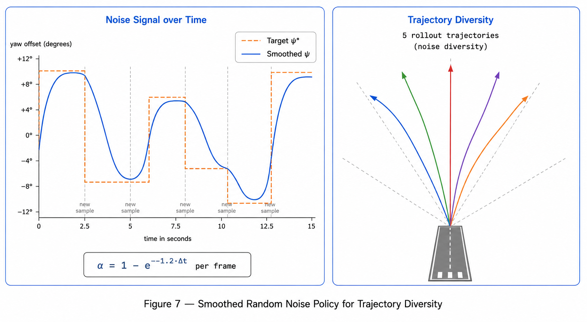

---

## 시스템 아키텍처

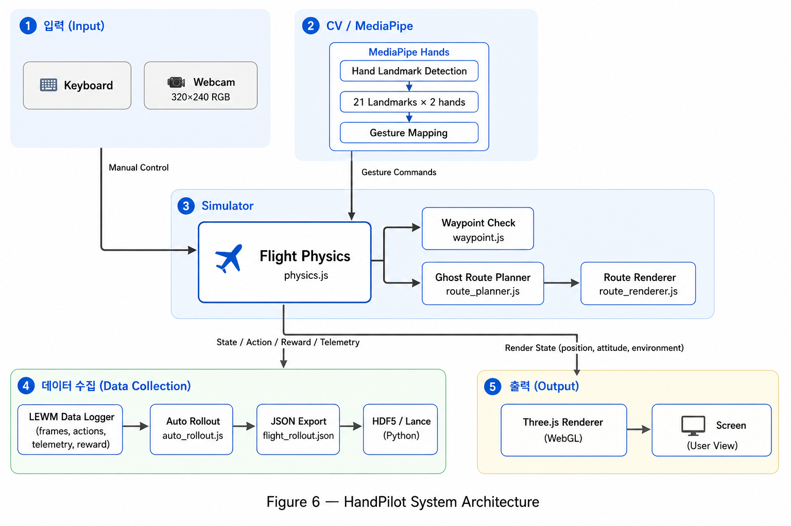

---

## 프로젝트 구조

```
handpilot/
├── index.html
├── css/style.css
├── js/
│   ├── main.js               # 진입점, 렌더러, 게임 루프
│   ├── hands.js              # MediaPipe 손 인식 + 제스처 매핑
│   ├── physics.js            # 비행 물리 + stepPhysicsState (순수함수)
│   ├── route_planner.js      # Ghost Route — 후보 경로 롤아웃 + 점수
│   ├── route_renderer.js     # Ghost Route — Three.js 경로 라인 렌더링
│   ├── model_panel.js        # Ghost Route HUD 패널
│   ├── auto_rollout.js       # Auto Rollout 루프 + smoothed noise
│   ├── lewm_data_logger.js   # 프레임/액션/텔레메트리 수집 + export
│   ├── waypoint.js           # 웨이포인트, ILS 착륙 유도, 비행 궤적
│   ├── airplane.js           # 비행기 3D 모델 (절차적 생성)
│   ├── world.js              # 지형, 활주로, 나무, 산, 호수, 도시
│   ├── camera.js             # 3인칭 카메라 추적
│   ├── hud.js                # HUD, AHI, 미니맵
│   ├── audio.js              # Web Audio API 효과음
│   └── stage.js              # 스테이지 관리
├── training/
│   ├── export_flight_hdf5.py # JSON → HDF5 변환
│   └── export_flight_lance.py# JSON → Lance 변환 (LeWM 호환)
├── manifest.json             # PWA
└── sw.js                     # Service Worker
```

---

## 실행 방법

### 환경 요구사항

| 항목 | 요구사항 |
|------|----------|
| 브라우저 | Chrome / Edge 최신 버전 (WebGL 2.0, ES Modules 지원) |
| 웹캠 | 내장/외장 카메라 (MediaPipe 손 인식용) |
| 로컬 서버 | Python 3 또는 Node.js (HTTPS 없이 로컬 실행 시) |
| 데이터 변환 (선택) | Python 3.8+, h5py, PyArrow, Lance |

> 웹캠 접근은 HTTPS 또는 `localhost`에서만 허용됩니다.

### 1. 클론

```bash
git clone https://github.com/Jaehyeon-kr/Handpilot.git
cd Handpilot
```

### 2. 로컬 서버 실행

```bash
# Python
python -m http.server 8080

# Node.js
npx serve .
```

브라우저에서 `http://localhost:8080` 접속 → 카메라 권한 허용.

### 3. 조종 방법

| 입력 | 동작 |
|------|------|
| 오른손 주먹 | 추력 증가 (W) |
| 오른손 펴기 | 감속 (S) |
| 왼손 기울이기 → | 우회전 (D) |
| 왼손 기울이기 ← | 좌회전 (A) |
| 오른손 손목 위 | 기수 올림 (Q) |
| 오른손 손목 아래 | 기수 내림 (E) |
| `G` 키 | 랜딩기어 토글 |
| `R` 키 | 리셋 |

### 4. Auto Rollout 사용법

1. 좌측 **GHOST ROUTES** 패널에서 **▶ Auto x10** 클릭
2. 비행기가 자동으로 이륙 → WP1 통과 10회 반복
3. 완료 시 `flight_rollout_auto_10ep.json` 자동 다운로드
4. **Stop** 버튼으로 중단해도 현재까지 수집한 데이터 저장됨

### 5. 데이터 변환 (선택)

```bash
pip install h5py Pillow numpy tqdm lance pyarrow

# HDF5 변환
python training/export_flight_hdf5.py flight_rollout_auto_10ep.json --out flight.h5 --img-size 64

# Lance 변환 (LeWM 호환)
python training/export_flight_lance.py flight_rollout_auto_10ep.json --out data/flight.lance
```

---

## 기술 스택

| 분류 | 기술 | 버전 / 비고 |
|------|------|------------|
| 손 인식 | [@mediapipe/hands](https://github.com/google-ai-edge/mediapipe) | 0.4 (Apache 2.0) |
| 카메라 | [@mediapipe/camera_utils](https://github.com/google-ai-edge/mediapipe) | 0.3 |
| 3D 렌더링 | [Three.js](https://threejs.org) | 0.160.0 (MIT) |
| 오디오 | Web Audio API | 브라우저 내장 |
| 데이터 변환 | h5py, PyArrow, Lance | Python 스크립트 |
| 프론트엔드 | Vanilla JS (ES Modules) | importmap 방식, 빌드 불필요 |
| PWA | Service Worker + Web App Manifest | 오프라인 지원 |
| 라이선스 | Apache 2.0 | 모든 의존성과 호환 |

---

## 관련 연구

### 컴퓨터 비전

- **MediaPipe Hands** — Zhang et al., 2020. [On-device, Real-time Hand Tracking](https://arxiv.org/abs/2006.10214)
  실시간 손 랜드마크 감지 모델. 본 프로젝트의 CV 입력 레이어로 사용.

### World Model / RL — 프로젝트의 동기

- **World Models** — Ha & Schmidhuber, 2018. [World Models](https://arxiv.org/abs/1803.10122)
  에이전트가 환경의 압축된 내부 모델을 학습하여 상상 속에서 계획할 수 있음을 보인 선구적 연구.

- **DreamerV3** — Hafner et al., 2023. [Mastering Diverse Domains through World Models](https://arxiv.org/abs/2301.04104)
  단일 world model로 다양한 도메인을 마스터하는 방법론. 시뮬레이터 기반 데이터 수집의 중요성을 부각.

- **LeWorldModel (LeWM)** — Maes et al., 2026. [LeWorldModel: Stable End-to-End Joint-Embedding Predictive Architecture from Pixels](https://arxiv.org/abs/2603.19312)
  world model 학습을 위한 trajectory 데이터 수집 프레임워크. HandPilot Auto Rollout의 JSON/Lance 포맷은 LeWM 파이프라인과 호환되도록 설계되었으며, **"flight domain용 시뮬레이터가 필요하다"는 동기를 직접 제공한 연구**.

---

## 스크린샷

| 활주로 시작 | 손 제스처 인식 | 웨이포인트 링 통과 |
|:-----------:|:--------------:|:-----------------:|
| 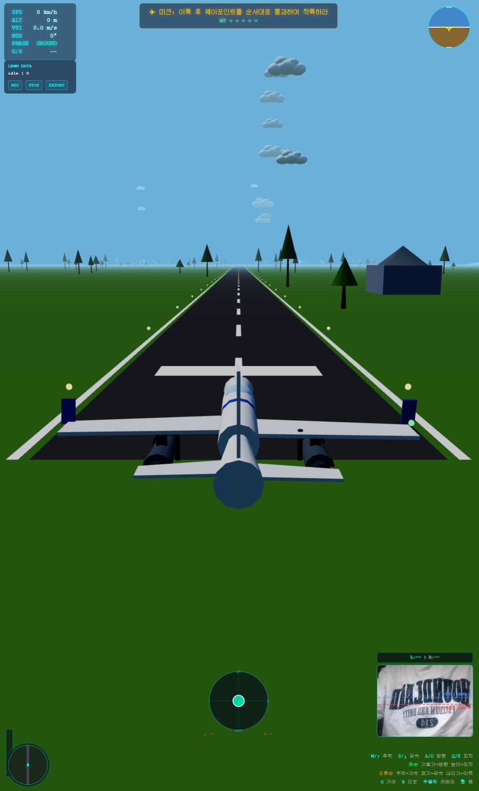 | 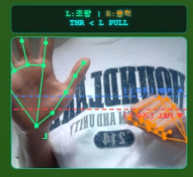 | 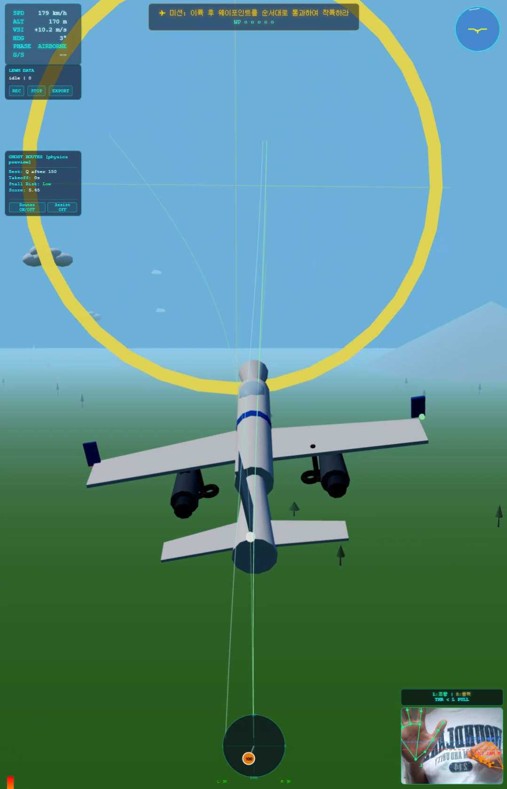 |
